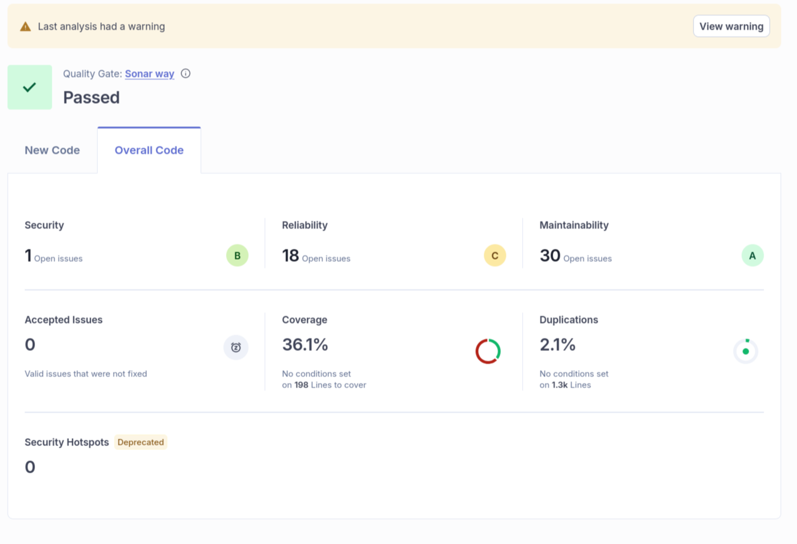
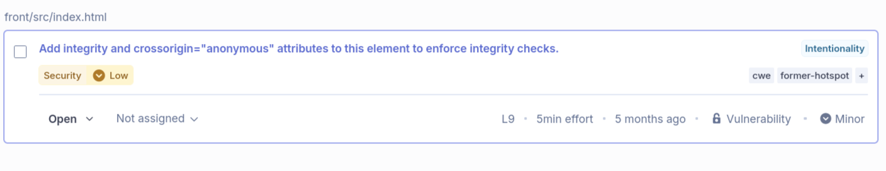
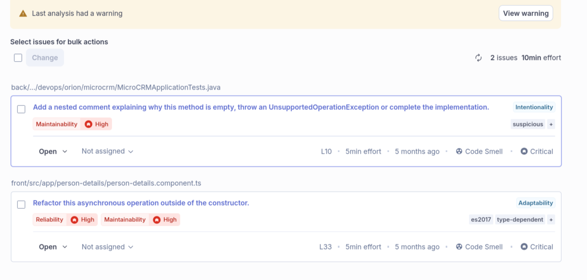
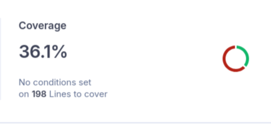
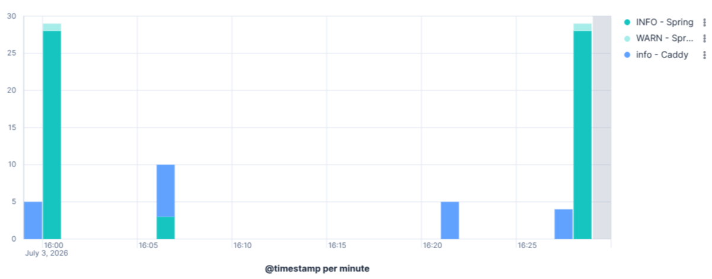

# Documentation technique – Pipeline CI/CD Orion MicroCRM

- **Auteur** : Victor Hazebrouck
- **Option choisie** : Option B (Scénario Orion)
- **Date** : 25 juin 2026

## 1. Introduction

### Contexte du projet

L’entreprise Orion souhaite moderniser son processus de livraison logicielle afin d’automatiser les builds, les tests et les déploiements.

### Objectifs de l’industrialisation

- Automatiser le build front-end et back-end
- Automatiser les tests unitaires
- Intégrer SonarQube Cloud
- Conteneuriser l’application avec Docker
- Mettre en place un pipeline CI/CD complet

### Technologies principales

- Java 17 / Spring Boot / Gradle
- Node.js 20
- Docker & Docker Compose
- SonarQube Cloud
- GitHub Actions
- GitHub Container Registry

### Présentation rapide du pipeline CI/CD mis en place

- build-back
- build-front
- test-back
- test-front
- sonarqube
- containerization
- deploy
- dora

## 2. Étapes de mise en œuvre du pipeline CI/CD

### 2.1 Structure du pipeline

Le pipeline est déclenché sur chaque push et merge sur la branche main, Ainsi qu'une fois par jour
à 02h00 heure globale.

#### Étapes principales

- build-back
- build-front
- test-back
- test-front
- sonarqube-back
- sonarqube-front
- containerization
- deploy
- dora

#### Ordre d’exécution

```
build-back  -> test-back  -> sonarqube-back
                                             -> containerization -> deploy -> dora
build-front -> test-front -> sonarqube-front
```

#### Justification du choix des actions GitHub

- **actions/checkout@v5**  
  Permet de récupérer le contenu du dépôt GitHub sur le runner afin que le workflow puisse accéder
  au code source. Cette action est indispensable au démarrage de la majorité des pipelines CI/CD.

- **gradle/actions/setup-gradle@v5**  
  Configure l'environnement Gradle, met en cache les dépendances et optimise les temps de
  compilation. Elle améliore les performances des builds Java et facilite l'exécution des tâches
  Gradle.

- **actions/setup-java@v5**  
  Installe et configure la version du JDK requise par le projet. Cette action garantit que les
  étapes de compilation, de tests et d'analyse utilisent un environnement Java cohérent.

- **actions/setup-node@v6**  
  Installe la version de Node.js nécessaire au projet frontend. Elle permet d'exécuter les
  commandes `npm`, `pnpm` ou `yarn` pour installer les dépendances, lancer les tests et
  construire l'application.

- **actions/upload-artifact@v6**  
  Sauvegarde les artefacts générés pendant le workflow (rapports de tests, fichiers compilés,
  couverture de code, etc.) afin qu'ils puissent être réutilisés par d'autres jobs ou téléchargés
  après l'exécution.

- **actions/download-artifact@v8.0.1**  
  Télécharge les artefacts précédemment enregistrés avec `upload-artifact`. Cette action facilite
  le partage de fichiers entre différents jobs d'un même workflow.

- **SonarSource/sonarqube-scan-action@v7.1.0**  
  Lance l'analyse statique du code avec SonarQube afin d'évaluer la qualité du code. Elle détecte
  notamment les bugs potentiels, les vulnérabilités de sécurité, les duplications de code et mesure
  la couverture des tests.

- **docker/login-action@v4**  
  Authentifie le runner auprès d'un registre de conteneurs (Docker Hub, GitHub Container Registry,
  etc.) afin de pouvoir publier les images Docker construites par le pipeline.

- **docker/metadata-action@v6**  
  Génère automatiquement les métadonnées des images Docker (tags, labels, versions, SHA du commit,
  branche, etc.), garantissant une convention de nommage cohérente et facilitant la traçabilité des
  images.

- **docker/build-push-action@v7**  
  Construit les images Docker à partir du `Dockerfile`, exploite les fonctionnalités de BuildKit
  pour optimiser les builds et publie les images sur le registre configuré. Cette action constitue
  l'étape finale de la chaîne de conteneurisation.

### 2.2 Scripts d’automatisation

#### Scripts utilisés

N/A (on utilise les github actions)

#### Leur rôle dans le pipeline

N/A (on utilise les github actions)

#### Comment les exécuter ou les adapter

N/A (on utilise les github actions)

### 2.3 Reproductibilité

#### Comment relancer le pipeline

Push ou relancer sur github directement.

#### Gestion des secrets (sans jamais les afficher)

- `SONAR_TOKEN`: à aller chercher sur sonarqube cloud et renseigner dans les secrets du depot github.

## 3. Plan de conteneurisation et de déploiement

### 3.1 Dockerfiles

#### Principaux choix techniques

- **`FROM node AS front-build`** :
  Étape de compilation du frontend. Les outils Node.js sont utilisés uniquement pendant le build
  et ne sont pas inclus dans l'image finale.

- **`FROM gradle:jdk17 AS back-build`** :
  Étape de compilation du backend avec Gradle et JDK 17. Produit le JAR de l'application sans
  embarquer les outils de développement en production.

- **`FROM alpine:3.19 AS front`** :
  Image d'exécution minimale pour servir les fichiers statiques du frontend. Le choix d'Alpine
  permet de réduire la taille de l'image et la surface d'attaque.

- **`FROM alpine:3.19 AS back`** :
  Image d'exécution du backend contenant uniquement le JRE et le JAR compilé. La séparation entre
  build et runtime améliore la sécurité et les performances.

- **`FROM alpine:3.19 AS standalone`** :
  Regroupe le frontend et le backend dans une image unique, simplifiant le déploiement tout en
  conservant les avantages d'une construction multi-stage.

#### Explication du multi-stage build

Le multi-stage build consiste à utiliser plusieurs instructions `FROM` dans un même `Dockerfile`,
chaque étape ayant un rôle précis (compilation, packaging, exécution).

Les premières étapes (`front-build` et `back-build`) utilisent des images contenant les outils de
développement (Node.js, Gradle, JDK) pour construire l'application. Les étapes suivantes (`front`,
`back` et `standalone`) ne récupèrent que les artefacts produits (fichiers statiques et JAR) et
excluent les outils de compilation.

Cette approche présente plusieurs avantages :

- réduction de la taille des images finales
- diminution de la surface d'attaque en supprimant les outils de développement
- amélioration des temps de téléchargement et de déploiement
- séparation claire entre les environnements de build et d'exécution

### 3.2 docker-compose.yml

#### Services définis

##### application

- front
- back

##### elk

- elasticsearch
- kibana
- logstash

#### Instructions pour lancer l’application localement

```sh
# start elk stack
docker compose -f docker-compose-elk.yml up --build

# start application
docker compose up --build
```

- dashboard: [http://localhost:5601](http://localhost:5601)
- front: [http://localhost](http://localhost)
- api: [http://localhost:8080](http://localhost:8080)

## 4. Plan de testing périodique

### 4.1 Types de tests automatisés

#### Tests unitaires, d’intégration ? de sécurité (SonarQube) ?

Tests unitaires, integration, et securité.

#### Autres tests éventuels

N/A

#### quand les tests doivent être exécutés ?

`push`, `merge`, `nightly` et `release`.

#### quels tests à quelle étape ?

Tous les tests à chaque fois

#### quels critères de réussite ou d’alerte ?

Tous les tests ok -> reussite
Un test nok -> alerte

### 4.2 Fréquence d'exécution

#### Sur push

À chaque push.

#### Sur pull request

À chaque pull request.

#### Nightly build / exécution périodique

Une fois par jour.

### 4.3 Objectifs des tests

#### Qualité

Assurer la qualité du code: Correctness, Reliability, Security, Maintainability.

#### Non-régression

Assurer la non régression: Correctness, Reliability, Maintainability.

#### Vérification du bon fonctionnement avant déploiement

Assurer le bon fonctionnement du code avant de déployer: Correctness, Reliability.

## 5. Plan de sécurité

### 5.1 Résultats SonarQube



#### Vulnérabilités identifiées



#### Code Smells critiques



<!--#### Zones de complexité-->

#### Couverture des tests



### 5.2 Analyse des risques

#### Vulnérabilités

L’absence des attributs integrity et crossorigin="anonymous" sur les ressources externes (scripts
CDN, librairies tierces) expose l’application à des attaques de type supply chain attack.

Dans ce cas, si une dépendance externe est modifiée (compromission du CDN, injection de code
malveillant, ou remplacement de fichier), le navigateur exécutera automatiquement ce code sans
vérification d’intégrité.

Cela peut entraîner :

- Exécution de code malveillant côté client
- Vol de données utilisateurs (tokens, cookies, sessions)
- Injection de scripts (XSS indirect via dépendances)
- Compromission complète du front-end

#### Risques liés au pipeline

Le pipeline actuel présente également plusieurs zones de risques potentiels:

- Risque si des secrets GitHub (SONAR_TOKEN, registry credentials) sont mal configurés ou exposés dans les logs
- Images de base peuvent contenir des vulnérabilités connues ou obsolètes
- Node.js / npm packages et dépendances Gradle peuvent contenir des vulnérabilités connues ou obsolètes

### 5.3 Plan d’action / Remédiation

#### Actions immédiates

- s’assurer que tous les secrets (SONAR_TOKEN, GITHUB_TOKEN, registry credentials) sont stockés uniquement dans GitHub Secrets
- éviter toute sortie de secrets dans les logs CI/CD
- vérifier les permissions minimales des tokens utilisés

#### Actions à court terme

- mettre en place le pinning des versions des dépendances (npm / Gradle)
- intégrer un outil de scan des dépendances (Dependabot ou Renovate)
- séparer clairement les environnements (staging / production) dans les jobs de déploiement
- ajouter une stratégie de rollback automatique en cas d’échec de déploiement

#### Actions à long terme

- mettre en place la signature des images Docker (cosign ou Notary)
- automatiser les mises à jour de dépendances avec validation via CI
- renforcer la gouvernance de sécurité (policy-as-code sur les pipelines)
- mettre en place un mirror pour les `images de base Docker`, les dépendances `npm` et `Gradle`

## 6. Monitoring, métriques & KPI

### 6.1 Métriques DORA

#### Lead Time

Le Lead Time observé est de **875 secondes**, correspondant au temps écoulé entre le commit et le
déploiement effectif en environnement cible. Cette valeur inclut les étapes de build, tests,
analyse qualité, conteneurisation et déploiement.

#### Deployment Frequency

Non applicable pour le moment, car project pas en production.

#### Mean Time To Restore

Non applicable pour le moment, car pas de breaking features.

#### Change Failure Rate

Le Change Failure Rate est défini comme le pourcentage de déploiements ayant entraîné une erreur
nécessitant un rollback ou une correction immédiate.

```
Change Failure Rate = (nok / ok) × 100
```

Non applicable pour le moment, car pas de features.

### 6.2 KPI personnalisés

#### Temps de build

- Back: 1m 12s
- Front: 43s

#### Temps des tests

- Back: 1m 23s
- Front: 1m 01s

#### Taux d’erreurs dans les logs

- Back: 0%
- Front: 0%

### 6.3 Analyse synthétique du monitoring

#### Tendances observées

Le pipeline CI/CD montre une exécution stable avec des temps de build et de tests cohérents entre
le backend et le frontend. Le backend présente des durées légèrement plus élevées, ce qui est
attendu en raison de la compilation Java et de l’exécution des tests Spring Boot. Le frontend reste
plus rapide et plus constant. Aucun écart anormal ou dégradation progressive des performances n’a
été observé.

#### Points forts

- Pipeline entièrement automatisé et reproductible
- Bonne séparation des responsabilités entre backend et frontend
- Temps de build et de tests raisonables
- Taux d’erreurs dans les logs à 0%, indiquant une stabilité globale
- Intégration de SonarQube pour le contrôle qualité
- Traçabilité complète via artefacts CI et logs DORA

#### Points à améliorer

- Les métriques de ci ne sont pas encore centralisées dans un outil de monitoring dédié
- Pas de corrélation automatique entre qualité de code et incidents de déploiement

#### Dashboards



#### Alertes

- Alertes SonarQube sur dépassement de Quality Gate
- Notifications GitHub Actions en cas d’échec de workflow

## 7. Plan de sauvegarde des données

### 7.1 Ce qui doit être sauvegardé

#### Fichiers de configuration

Les éléments de configuration `publics` à sauvegarder sont:

- sonar-project.properties
- Dockerfile
- docker-compose.yml
- docker-compose-elk.yml
- ci.yml

Les éléments de configuration `secrets` à sauvegarder sont:

- variables d'environement (i.e SONAR_TOKEN)

#### Artefacts de build

Les artefacts de `build` à sauvegarder sont:

- Rapports de tests backend
- Rapports de couverture frontend
- Résultats SonarQube (Quality Gate, analyses)
- Images Docker

Ces artefacts permettent de:

- restaurer une version stable
- analyser un incident passé
- reproduire un build exact

### 7.2 Procédure de sauvegarde

#### Format

Les sauvegardes sont effectuées sous plusieurs formats:

- Artefacts CI/CD: fichiers ZIP gérés par GitHub Actions (`upload-artifact`)
- Images Docker: stockées dans GHCR (`ghcr.io`)
- Logs et rapports: fichiers NDJSON / HTML / XML selon les outils
- Code source: versionné via Git (GitHub)

#### Fréquence

- À chaque push sur `main` et `pull request`
  exécution des tests, génération des rapports, génération des artefacts et images Docker
- Tous les jours à 02h00 (UTC): exécution du pipeline via `schedule` (build + tests + analyse)
- Sauvegarde continue implicite via Git (chaque commit est historisé)

#### Outils utilisés

- GitHub Actions: orchestration CI/CD et stockage d’artefacts
- GitHub (Git): versioning du code source
- GitHub Container Registry (GHCR): stockage des images Docker
- `actions/upload-artifact`: sauvegarde des rapports de test
- SonarQube: analyse qualité du code
- Docker: packaging des applications

### 7.3 Procédure de restauration

#### Scénario d’incident

Les scénarios suivants sont pris en compte:

- Déploiement d’une version instable en production
- Régression fonctionnelle après merge sur `main`
- Image Docker corrompue ou vulnérable
- Perte de disponibilité du service après release

#### Étapes pour revenir à une version stable

La première étape est d'identifier la dernière verion stable. Consulter l’historique des commits,
identifier un build stable validé par SonarQube Quality Gate OK, tests ok, déploiement ok.

Puis il suffit de restaurer le head vers le commit en question.

```bash
git checkout <commit-id-stable>
git push origin main
```

La restauration du deployement sera gérée automatiquement par la pipeline.

## 8. Plan de mise à jour

### 8.1 Mise à jour de l’application

#### Couvertures de test

Une couverture de tests minimale de 90% doit être atteinte et maintenue avant toute mise à jour
du système (dépendances, framework ou pipeline CI/CD). Ce seuil garantit un niveau de confiance
suffisant dans la stabilité de l’application et permet de détecter rapidement les régressions
introduites par une évolution du code. Toute mise à jour ne respectant pas ce critère doit être
bloquée dans le pipeline CI/CD jusqu’à ce que la couverture soit restaurée, afin d’assurer la
fiabilité, la maintenabilité et la sécurité continue du système.

#### Dépendances Maven / npm

Les dépendances applicatives doivent être régulièrement mises à jour afin de garantir la sécurité 
et la stabilité du projet.

- **Backend (Maven / Gradle)**:
  - Mise à jour des dépendances Spring Boot et librairies tierces
  - Utilisation de `./gradlew dependencyUpdates` ou équivalent pour identifier les versions obsolètes
  - Vérification des CVE connues via SonarQube ou OWASP Dependency Check

- **Frontend (npm)**:
  - Mise à jour via `npm update` ou outils comme `npm audit`
  - Surveillance des vulnérabilités avec `npm audit fix`
  - Éviter les versions non maintenues des packages

Objectif: réduire les vulnérabilités connues et garantir la compatibilité des composants.

#### Mises à jour Angular / Spring Boot

Les frameworks principaux doivent suivre un cycle de mise à jour contrôlé:

- **Angular**:
  - Mise à jour via `ng update`
  - Migration progressive entre versions majeures
  - Vérification des breaking changes

- **Spring Boot**:
  - Mise à jour vers versions LTS recommandées
  - Validation des changements de configuration
  - Tests de non-régression obligatoires dans le pipeline CI/CD

Une mise à jour majeure doit toujours être testée dans une branche dédiée avant merge sur `main`.

#### Mises à jour Docker (images)

Les images Docker doivent être maintenues à jour:

- Reconstruction régulière des images pour intégrer les patchs de sécurité
- Scan des images via outils type Trivy ou Grype
- Évitement des tags non figés (`latest` en production)

### 8.2 Mise à jour du pipeline CI/CD

#### Versions des actions GitHub

Les actions GitHub utilisées doivent être maintenues:

- `actions/checkout`
- `actions/setup-node`
- `actions/setup-java`
- `docker/build-push-action`
- `SonarSource/sonarqube-scan-action`

Bonnes pratiques:

- Fixer des versions explicites (`@v5`, `@v7`)
- Surveiller les releases des actions
- Mettre à jour progressivement pour éviter les ruptures

#### Versions des scripts

Les scripts utilisés dans le pipeline doivent être:

- Versionnés dans le dépôt Git
- Documentés et testés
- Compatibles avec les environnements CI (Ubuntu 22.04)

Exemples:

- scripts Gradle (`./gradlew`)
- scripts npm (`npm run build`, `npm run test-cov`)
- scripts Docker Compose

#### Maintenance du workflow

Le fichier `.github/workflows/ci.yml` doit être régulièrement revu:

- Optimisation des temps de build
- Vérification des dépendances entre jobs (`needs`)
- Ajout de nouveaux contrôles qualité (security scan, lint, etc.)

Objectif: garder un pipeline rapide, fiable et sécurisé.

### 8.3 Fréquence & bonnes pratiques

#### Conseils pour maintenir la solution dans le temps

- Effectuer des mises à jour `mensuelles` des dépendances critiques
- Appliquer les correctifs de sécurité dès leur publication
- Automatiser les mises à jour mineures via Dependabot ou Renovate
- Conserver un environnement de staging pour tester les mises à jour
- Ne jamais déployer directement une mise à jour majeure en production sans validation CI complète
- Surveiller les logs CI/CD pour détecter les dégradations de performance
- Documenter chaque mise à jour importante dans le dépôt Git

Objectif global: garantir la `stabilité`, la `sécurité` et la `maintenabilité` du système dans la durée.

## 9. Conclusion

## 9. Conclusion

#### Résumé des améliorations apportées

La mise en place du pipeline CI/CD Orion MicroCRM a permis d’automatiser l’ensemble du cycle de vie
applicatif, depuis la compilation jusqu’au déploiement. Le projet intègre désormais des étapes de
build séparées pour le front et le back, des phases de tests automatisés, ainsi qu’une analyse de
qualité de code via SonarQube. La conteneurisation des applications et la publication des images
Docker dans le GitHub Container Registry assurent une distribution standardisée et reproductible.
Enfin, l’ajout d’un reporting DORA permet de suivre les performances du cycle de livraison.

#### Gains observés (fiabilité, rapidité, qualité)

L’automatisation du pipeline a significativement amélioré la fiabilité des livraisons en réduisant
les erreurs humaines lors des déploiements. La séparation des jobs et l’exécution parallèle des
étapes de build et de test ont permis d’optimiser les temps d’exécution globaux. La qualité du code
est désormais mieux contrôlée grâce à SonarQube et aux rapports de tests automatisés. En parallèle,
la traçabilité des versions et des déploiements est renforcée grâce aux artefacts CI/CD et aux
images Docker versionnées.

#### Recommandations pour les itérations suivantes

Pour les futures évolutions du projet, il est recommandé de renforcer encore la sécurité du
pipeline en ajoutant des scans de vulnérabilités sur les images Docker et les dépendances
applicatives. La mise en place de quality gates bloquants sur SonarQube permettrait d’empêcher tout
déploiement en cas de régression critique. Il serait également pertinent d’introduire un
environnement de staging distinct pour valider les déploiements avant production. Enfin,
l’intégration de mécanismes de rollback automatisé et de signature des artefacts améliorerait
encore la robustesse globale de la chaîne CI/CD.
